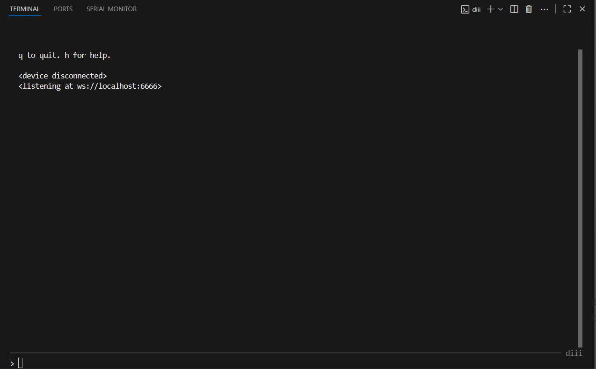

# iii-script-boilerplate

A usb midi keyboard iii script for Monome Grids


## [User Manual](/manual.md)

## Features

## TODO

* [ ] Replace all instances of `<script name>` in .vscode/tasks.json with the name of your script

## Idea Brainstorm

## Prerequisites

* Python 3.11
* A One or Zero grid with >=[250114](https://github.com/monome/iii/releases/tag/250114) or newer iii firmware.
  
*iii [Grid Compatibility](https://github.com/monome/iii?tab=readme-ov-file#compatibility) varies*

Follow `diii` install steps from the [monome iii repo](https://github.com/monome/iii?tab=readme-ov-file#diii)

## First Time Setup

There are two ways to set up your local copy of this project. **The fastest and simplest way is through the included `VS Code` tasks.** If you just want it to work or are not comfortable with command line things, this is the easiest and fastest way down the mountain.

Start by installing [VS Code]() from the official web page (Always check the url).

1. Install python 3.11
2. Run the setup script

***VS Code***

`ctrl+shift+p` type `run task` and select `Setup Environment`

***Terminal***

*Windows*

```powershell
./scripts/setup.ps1
```

*Linux/MacOS*

```bash
source scripts/setup
```

Verify things are working by [launching diii](#launching-diii):

If you want to jump right into the business, go to [the next section](#quick-flash).

## Quick flash

1. Connect the `iii` device
2. Press `ctrl+shift+b` from VS Code to upload the latest script

## Launching diii



Launch `diii` with one of the following methods, you should see a console similar to the image above.

To exit `diii`, type `q` into the console and press `enter`. For other `diii` commands check out the docs [here](https://github.com/monome/iii?tab=readme-ov-file#run).

***VS Code***

* Task: `ctrl+shift+p` type `run task` and select `Launch diii`
* Terminal: Open a new terminal in VS Code and run `diii`

***Terminal***

*Windows*

```powershell
./.venv/Scripts/activate.ps1; diii
```

*Linux/MacOS*

```bash
source .venv/Scripts/activate && diii
```

### Talking to iii devices

1. Launch `diii`
2. Connect the device to the computer via usb

If `<device connected>` is printed to the shell, you are all set.
If not, try [this](#flip-device-mode) from the troubleshooting guide and reconnect the device to the computer.

## Troubleshooting

### Flip Device Mode

Here is a [description of device modes](https://github.com/monome/iii?tab=readme-ov-file#modes) when running `iii` compatible firmware. Follow steps outlined in that section of the `iii` docs to flip the device between `iii` and `standard serial` modes.

### DeviceNotFoundError(f"can't find iii device")

Error message:

```shell
  File "C:\Users\jguza\source\repos\iiiano\.venv\Lib\site-packages\diii\cli.py", line 43, in upload
    iii.connect()
  File "C:\Users\jguza\source\repos\iiiano\.venv\Lib\site-packages\diii\iii.py", line 48, in connect
    self.serial = self.find_device()
                  ^^^^^^^^^^^^^^^^^^
  File "C:\Users\jguza\source\repos\iiiano\.venv\Lib\site-packages\diii\iii.py", line 30, in find_device
    portinfo = find_serial_port('USB VID:PID=CAFE:1101')
               ^^^^^^^^^^^^^^^^^^^^^^^^^^^^^^^^^^^^^^^^^
  File "C:\Users\jguza\source\repos\iiiano\.venv\Lib\site-packages\diii\iii.py", line 21, in find_serial_port
    raise DeviceNotFoundError(f"can't find iii device")
diii.exceptions.DeviceNotFoundError: can't find iii device
```

**Solution:** This is likely due to the device not connected to the computer or not being in iii mode. Follow the instructions [here](https://github.com/monome/iii?tab=readme-ov-file#modes) to flip modes.

If you run into a problem that isn't captured in this section, please [submit issues here](https://github.com/JGuzak/iiiano/issues). Make sure to include things like system information and screenshots/logs for the best chance of assistance.

### Uploading script gets stuck on "-- receiving script" step

Sometimes scripts don't clear properly when attempting to upload new scripts.

**Solution:** Follow one of the two suggestions to clear the currently loaded script then re-flash the desired script:

* [force clear iii script by following steps outlined in the `iii` docs](https://github.com/monome/iii?tab=readme-ov-file#modes)
* disconnect/reconnect the device, launch `diii` if it isn't already running, run `^^c` to clear the script
